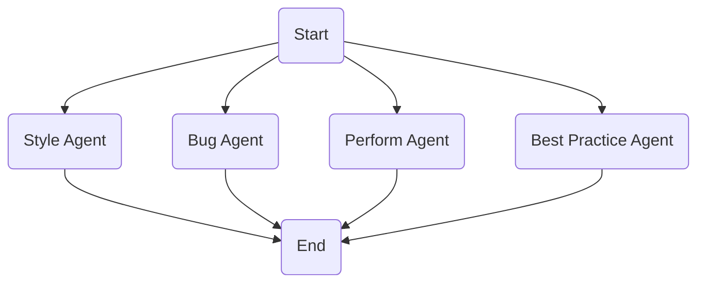

# What is this repository

This repository contains backend code for a code review agent.
It has apis to take a github repository and pull request number and github token and give code review as response.
The api creates a background celery task that goes to a celery worker through a redis broker.

## Table of Contents

1. [How to setup and run the code](#how-to-setup-and-run-the-code)
2. [Explanation of design and decisions](#explanation-of-design-and-decisions)
3. [Things that needs Improvements](#things-that-needs-improvements)
4. [What is not there yet but am currently doing it](#what-is-not-there-yet-but-am-currently-doing-it)

## Live Deployment Link

[https://code-review-agent.onrender.com/docs](https://code-review-agent.onrender.com/docs)

## How to setup and run the code

Install uv, see [uv documentation](https://docs.astral.sh/uv/).

Go inside base folder.

`uv sync`

Create .env file following .env.example file.
Setup postgres, redis, openai api key and put the url there.

To setup db

`run alembic upgrade head`

To run api service

For dev

`fastapi dev`

For prod

`fastapi run`

To run celery worker

`celery -A app.celery_app.celery_app worker --loglevel=info --queues=default`

To run tests

`pytest`

There is one integration test file to test whole flo and one test file to test all the agents
Run individual test files if necessary, since some tests include llm calls it will take time.

To deploy in a vm or cloud, install docker and docker compose. The .env file should be updated slightly to add host of postgres and redis to be just postgres and redis. Also need to keep postgres db name to be postgres. And then from inside base of the folder run

`docker compose up -d --build`

Call upgrade_database api if needed. [app/routers/migration_router](app/routers/migration_router)

In [app/schemas/pr_analysis_examples.py](app/schemas/pr_analysis_examples.py), I have added the example input request_body and reponse_body which also has code review of a pr from this repository.

# Explanation of design and decisions

I should have clarified the requirements beforehand.

For first phase of the code I wanted to write sync apis and background task to test the logic.
And later make changes to speed things up. by running files parellely using threads or asyncio.
Just need to be carefull of openai api rate limit errors

When creating the task we can specify the agent_type to test different agents

My default first idea implemented was to treat each file independently and get the whole file and diff and pass it to llm to get code review since openai models are already good at coding related tasks well.

The second step I used pydantic-ai library to make the agent.
and have additional prompt hints for different languages
based on file type This was in my scope but could not do in time.

The third step I did was adding ruff linter to check python code
we can also add other language specific tools to use with llm for reduced scope I only added ruff
So llm can call the tool and get output and again make another llm call to get an answer.

What improvements can we do at this stage, i think we can do deep research , chain of thought
to be absolutelty sure and get better quality results.

But some ideas I thought of were seperating each issue type and having specific agents
with sepecific tools for each issue type.
This could be like a style agent, bug agent etc and can act parallelly and then we can aggregate and combine and maybe even use another llm call at the end.

Another Idea i had was the inital github pr pulling and getting files and adding each file to seperate agent but i realise this is very deterministic and i dont think this needs to be part of the agent

# Diagrams

### Single Agent


### Multi Agent based on



# Things that needs Improvements

Add condition to exit non code files fast.
Add condition to exit very long files.

Error handling I do have a very nice context manager for the background task
but i could have handled each exception nicely and gave proper messages.

Can make things concurrent with threads or asyncio

Can keep status and error on file also and dont stop on one error of file complete all files then log error on task

Reuse previously done work

- check if (repo_url, pr) already exists in prev task
- if no create new task
- if yes check if (repo_url, pr) changed since the task
- if no just give back prev task_id
- if yes check each file
- if file has not changed reuse output else compute output

Naming could have been better got confused between analysis, review, and task

# What is not there yet but am currently doing it

rate limiting - coming in a few more minutes.

response caching - will take some more time.

---

```

```
